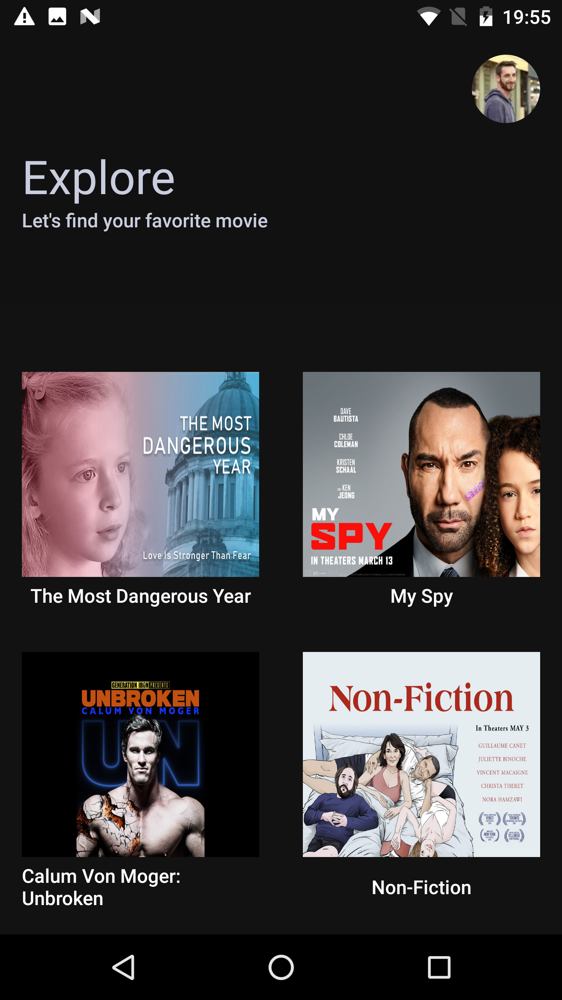
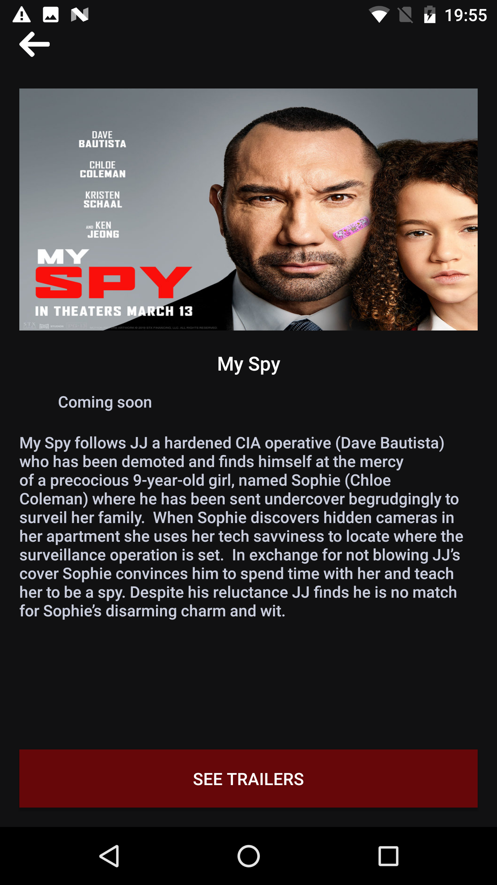

I did only one first commit. I am ashamed of myself. I should have commit more often but did not the inspiration for.

# Architecture

Three modules :
 - app: android view + viewmodel
 - data: repository + data source
 - models: every models

The first screen fetch the data in the init viewmodel.  
I try to separate the fetch action from the observe action. Since I thought that the fetch of info could be elsewhere in the app.
One of the idea, I got it to put that in a worker manager to fetch data before the user will open the app or to refresh data more frequently.

So the data is fetch from the WS at the start of the app and saved in the local database. Each screen observe the local database to get the info.

Flow goes like this :
 - Fetch : fetchMovies (MoviesListViewModel) -> fetchMovies (Repository) -> fetchMovides (RemoteDataSource) -> fetch data in ws -> saveMovies (LocalDataSource)
 - Observe : observeMovies (MoviesListViewModel) -> observeMovies (Repository) -> observeMovies (LocalDataSource) -> getch in db

# Testing

Not everything is tested but there is some unit test for the parsing and repository part.
Integration testing for the view and database.

# CI

A really simple GitHub action

# Left to do

- Video player is poorly implemented (no good ui, no handle of error)

- Each time we refresh the data, we erase everything. We can just try to guess what have been updated to avoid certain database operation.
  See algo in saveMovies in LocalDataSoource

- When we fetch data, we could have a pagination in room to get only data that matter

- The app is vulnerable to certificate pinning and use of http

- For trailers url, we only use srcAlt attribute. We can implement an algo that goes like this :  try to use alt attribute, if it fail use srcAlt

- integration test for fetching remote are not done

- proguard

# Screenshoot

